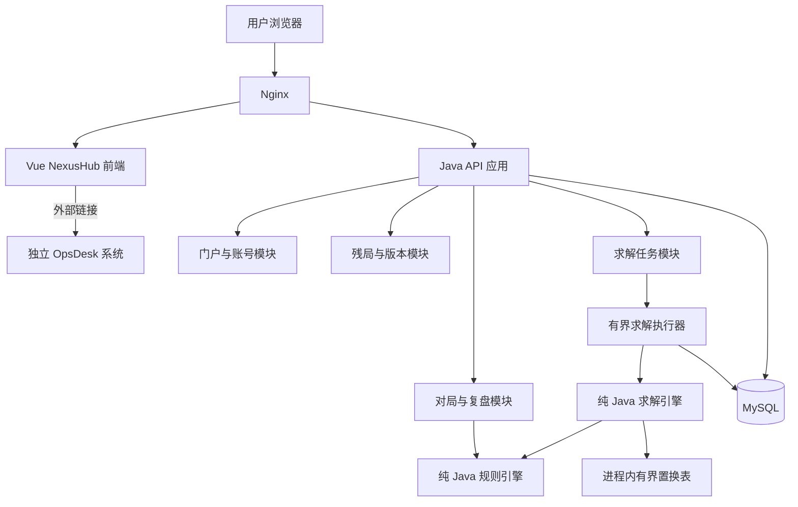
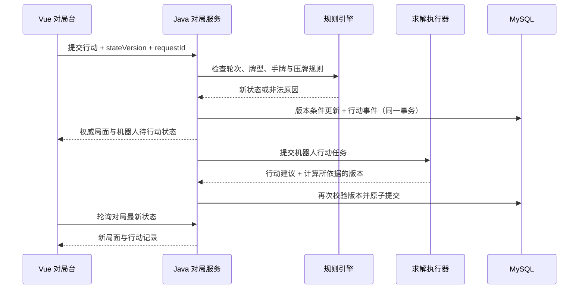

# NexusHub 第一版方案与整体架构

> 历史方案：其中“三人、地主/农民、农民协作”的斗地主模型已被后续需求替代。当前开发基线以 `doc/domain/rules.md`、`doc/requirements/`、`doc/api/openapi.json` 和 `doc/database/schema.sql` 为准：两名独立玩家 USER/BOT、完全明牌、先手首次必须出牌、四带二不可用、必胜证明最多展示 5 条路线。

版本：V0.1（方案评审稿）  
日期：2026-09-17  
主要技术：Vue 3 + TypeScript + Java + Spring Boot

## 1. 方案结论

建设一个可扩展的多系统入口 NexusHub，首页以卡片展示系统。第一张卡片进入内置的「斗地主残局实验室」，第二张卡片跳转已有 OpsDesk。后续增加系统时，优先通过入口配置扩展。

首版采用 **Vue 单页应用 + Java 模块化单体 + 纯 Java 规则与求解引擎**。规则引擎、求解引擎保持独立模块，初期随后端一起部署，计算量增长后可将求解模块迁移到独立 Java Worker。无需一开始引入微服务、微前端或大模型。

斗地主模块提供三种核心能力：

1. 配置、校验、保存和发布多种残局。
2. 用户选择任一座位，与另外两个机器人进行对局。
3. 分析任意合法局面，输出可证明的获胜阵营、推荐行动与应对策略。

**“必胜”指：在明牌、规则固定、农民协作且对手采取任意合法行动的条件下，某阵营存在保证获胜的策略。** 计算超时、搜索截断或启发式评估不能被展示成必胜证明。

## 2. 当前项目依据与设计边界

当前 NexusHub 工作区只有 `base.md` 和 `doc` 目录，没有前后端工程。`base.md` 是 OpsDesk 开发规范，记载其采用 Vue 3、Spring Boot 3、MyBatis、MySQL 等技术；本文没有实际核验 OpsDesk 代码、运行地址、登录接口或部署状态。

本文参考其 Vue 技术栈、分层结构、POST 动作化接口、字符串 ID、审计字段约定。其提到的 `docs/requirements`、数据库设计、接口契约与 Figma 文档未出现在当前工作区，不能据此假定已完成跨系统契约对齐。当前任务仅产出架构方案。

本文区分两类内容：

- 已明确需求：卡片式门户、残局配置、人机对局、胜负与策略分析、OpsDesk 跳转、Vue + Java。
- 建议默认值：明牌三人斗地主、固定地主、农民合作、无癞子、无叫地主和计分流程；这些可以在后续需求细化时调整。

## 3. 产品范围与页面方案

### 3.1 首版能力

| 模块 | 首版内容 | 后续扩展 |
|---|---|---|
| 系统门户 | 系统卡片、图标、简介、排序、启停、内部路由/外部链接 | 分组、收藏、使用统计、系统健康状态 |
| 残局库 | 搜索、标签、难度、草稿/发布状态、创建、复制、编辑、归档 | 分享、导入导出、题库专题 |
| 残局编辑器 | 三家手牌、地主座位、行动座位、起手/接牌状态、规则校验 | 批量导入、历史牌谱导入 |
| 人机对局 | 选座位、出牌、不出、提示、重新开始、逐步复盘 | 挑战计分、闯关、排行榜 |
| 分析中心 | 异步求解、取消、证明状态、获胜阵营、候选行动、策略分支 | 批量求解、证明导出 |
| OpsDesk 入口 | 配置 URL、新标签页跳转 | 单点登录、授权后的待办摘要 |
| 账号权限 | 普通用户、管理员；管理入口和发布能力受保护 | 统一身份源、细粒度角色 |

首版不包含真人联网对战、暗牌必胜判断、赛事平台、现金或积分交易、OpsDesk 内部功能迁移。

### 3.2 首页布局

```text
┌────────────────────── NexusHub ──────────────────────┐
│ Logo / 系统工作台                           账号 / 管理 │
│ 欢迎使用 · 选择要进入的系统                            │
│                                                      │
│ ┌─ 斗地主残局实验室 ─────┐ ┌─ OpsDesk ─────────────┐  │
│ │ 配置残局 · 人机博弈     │ │ 工单与协作平台         │  │
│ │ 胜负分析 · 策略复盘     │ │ 外部系统               │  │
│ │ [进入系统]             │ │ [打开 OpsDesk ↗]       │  │
│ └────────────────────────┘ └────────────────────────┘  │
└──────────────────────────────────────────────────────┘
```

卡片在桌面端采用网格，窄屏单列。卡片展示名称、简介、图标和入口类型；未配置 OpsDesk URL 时显示「待配置」，不跳转假地址。不在没有健康探测依据时展示“在线”。

### 3.3 斗地主页面

- **残局库**：按名称、标签、人工难度筛选；分析结果作为独立标记展示，不把未求解残局标成“必胜题”。
- **编辑器**：左侧基本信息，中间三个座位手牌，右侧轮次和规则；即时显示剩余可用牌数与校验错误。
- **对局台**：上方两个座位、下方用户手牌、中央当前牌墩与行动记录，右侧提示和分析。三个座位始终按固定顺序行动。
- **分析面板**：先显示“地主必胜 / 农民必胜 / 尚未证明”，再显示推荐首手、对手应对和后续行动。策略树按需展开。
- **复盘页**：逐手查看局面，标明是否已证明存在更优行动；没有证明依据时不标注“失误”。

默认用户控制一个座位。选择农民时，另一农民由机器人控制并以农民阵营获胜为目标。后续可增加同时控制两名农民的训练模式。

## 4. 技术选型

| 层次 | 建议方案 | 理由 |
|---|---|---|
| 前端 | Vue 3、TypeScript、Vite、Vue Router、Pinia | 类型约束、清晰的页面与对局状态管理 |
| UI | Element Plus + 自定义牌桌/扑克牌组件 | 管理页复用成熟组件，牌桌独立设计 |
| HTTP | Axios | 统一登录态、异常、请求约定 |
| 后端 | Java 21、Spring Boot、Spring Security | 业务接口、鉴权、任务编排 |
| 数据访问 | MyBatis XML、PageHelper | 与现有 OpsDesk 规范接近 |
| 主存储 | MySQL | 残局版本、对局、任务、策略与审计持久化 |
| 搜索缓存 | Java 进程内有界置换表 | 避免搜索节点访问远程缓存 |
| 可选缓存 | Redis，首版非必需 | 后续多实例限流、结果缓存、会话共享 |
| 异步执行 | 持久化任务表 + 有界执行器 | 首版无需消息队列即可实现限流、恢复 |
| 部署 | Nginx + Java 服务 + MySQL | 同源访问，部署和排障简单 |

Spring Boot 主版本在工程初始化时确定：优先评估与 OpsDesk 保持 Spring Boot 3.x 的维护成本，但必须核验选定版本的维护状态、Java 21 及依赖兼容性；若采用新主版本，应独立验证依赖。本文不将某个补丁版本写成未经验证的生产基线。

## 5. 整体架构



### 5.1 模块职责

| 模块 | 职责 | 边界 |
|---|---|---|
| hub | 系统入口配置、排序、可见性 | 不代理 OpsDesk 业务 |
| identity | 本系统账号、角色、资源权限 | 首版不假定与 OpsDesk 账号互通 |
| puzzle | 残局编辑、版本、发布、标签 | 调用规则引擎校验，不自行定义第二套牌型 |
| game | 回合推进、人类行动、机器人调度、事件记录 | 后端作为局面权威来源 |
| rules | 合法牌型、行动枚举、压牌、状态转移 | 不依赖 Spring、数据库或 HTTP |
| solver | 搜索、剪枝、缓存、证明、策略查询 | 只依赖规则引擎与不可变局面 |
| analysis | 任务排队、预算、取消、结果持久化 | 不在 HTTP 请求线程中执行深度搜索 |

### 5.2 建议工程结构

```text
NexusHub/
├─ doc/
├─ nexushub-frontend/
│  └─ src/
│     ├─ api/modules/
│     ├─ router/
│     ├─ stores/
│     ├─ components/cards/
│     └─ views/{hub,puzzles,game,analysis,admin}/
├─ nexushub-backend/
│  ├─ pom.xml
│  ├─ nexushub-app/          # Spring Boot 入口与业务模块
│  ├─ landlord-rules/        # 纯 Java 规则库
│  └─ landlord-solver/       # 纯 Java 搜索库
└─ deploy/
```

业务模块内部沿用 Controller / Service / Mapper / Entity / DTO / VO / Converter 分层。Maven 多模块是编译边界，不代表首版要部署多个服务。

## 6. 斗地主规则与局面建模

### 6.1 V1 规则建议

采用三人、单副 54 张牌、固定地主、明牌残局。座位 `0 → 1 → 2 → 0`，任一玩家出完手牌立即结束；地主出完即地主获胜，任一农民出完即农民阵营获胜。

牌点：`3 4 5 6 7 8 9 10 J Q K A 2 小王 大王`。普通点数最多 4 张，两种王各最多 1 张。花色不影响比较，内部使用 15 个点数的计数向量。

| 牌型 | V1 明确约定 |
|---|---|
| 单张、对子、三张 | 同型按主体点数比较 |
| 三带一、三带二 | 附带牌与主体点数不同 |
| 顺子 | 至少 5 个连续点数，不含 2 和王 |
| 连对 | 至少 3 个连续对子，不含 2 和王 |
| 飞机 | 至少 2 个连续三张主体，不含 2 和王；支持不带、带单、带对 |
| 飞机带单 | 每个主体三张配 1 张翼牌；翼牌不含主体点数，允许翼牌同点数，不允许双王同时作为翼牌 |
| 飞机带对 | 每个主体三张配 1 个对子；对子点数互异且不同于主体，不允许将四张同点数当作两对翼牌 |
| 四带二单 | 四张主体加 2 张，附牌可为对子，不允许双王同时作为附牌 |
| 四带二对 | 四张主体加 2 个不同点数对子，均不同于主体 |
| 炸弹 | 四张同点数；可压普通牌型，炸弹间比较点数 |
| 王炸 | 小王 + 大王，为最大牌型 |

上述翼牌等细节是产品规则提案，不宣称覆盖所有地区玩法；落地时固定为 `CLASSIC_V1`，后续规则变更创建新版本。普通牌型需类型、张数和主体长度匹配，比较主体点数；四带二不视为炸弹。

手牌允许拆分组合。接牌时即使能压也允许不出；自由领出时禁止不出。连续两人不出后清空待压牌，由最后出牌者重新领出。出现一组牌可按多个主体解释时，行动必须携带规范化牌型描述，后端校验该解释合法。

### 6.2 局面状态

```text
GameState
  hands[3][15]          三家当前手牌点数计数
  landlordSeat          地主座位
  currentSeat           下一行动座位
  targetMove            待压牌及牌型解释；自由领出时为空
  lastPlaySeat          最后有效出牌者；自由领出时可为空
  consecutivePasses     规范化状态取 0 或 1；第二次不出立即重置牌墩
  rulesetVersion        规则版本
```

持久化对局另外维护 `stateVersion`、用户控制座位、对局状态和事件序号；这些不是决定博弈结果的规则字段。

首版默认创建“自由领出”的残局，也支持高级编辑接牌局面。后者必须填写待压牌、最后出牌者和连续不出次数，并验证行动顺序一致；待压牌已经离开手牌，牌数校验需将其与剩余手牌合并计数。未提供完整历史时，只保证局面内部一致，不声称证明其可以从完整发牌历史到达。

三家起始手牌都应非空，地主剩余手牌不超过 20 张，农民分别不超过 17 张；总计不可超过 54 张。牌量大可以保存，但分析可能因预算不足返回未知。推荐先以总剩余 6～18 张构建首批基准题库，该范围不是性能保证。

## 7. 求解算法与“必胜”证明

### 7.1 建模为阵营对抗

三人依次行动，但目标只有两个：地主最大化地主收益，两位农民都最小化地主收益。因此不能按每换一个座位就取负号的普通双人 Negamax 直接实现。

使用地主视角终局收益：地主胜 `+1`，农民胜 `-1`。地主回合取子节点最大值，任一农民回合取最小值。农民连续行动时连续执行两次 MIN。

```text
solve(state):
  若终局：返回确切收益
  若预算耗尽：返回 UNKNOWN
  若缓存中存在可用的已证明结果：直接复用
  枚举当前座位所有合法行动
  地主节点：任一子节点确证 +1 即可证明 +1；全部确证 -1 才可证明 -1
  农民节点：任一子节点确证 -1 即可证明 -1；全部确证 +1 才可证明 +1
  其余情况：UNKNOWN
```

基础理论采用 Minimax 与 Alpha-Beta 剪枝。三人到两个阵营的映射是本项目基于共同收益假设作出的设计。有限手牌下每次有效出牌会减少手牌，且自由领出不能不出，规则内不会形成无限不出循环。

### 7.2 推荐实现顺序

1. 先实现无剪枝的穷举求解器，作为小规模局面的正确性参照。
2. 增加规范化局面、记忆化与合法行动去重。
3. 增加 Alpha-Beta、行动排序和有界置换表。
4. 增加预算、取消信号、搜索统计与异步任务。
5. 根据基准再评估证明数搜索、独立 Worker 等优化。

行动排序只影响速度，不得遗漏合法行动。搜索状态 Key 必须包括三家手牌、地主、行动座位、待压牌及解释、最后出牌者、不出次数和规则版本；不能只用手牌作为 Key。使用哈希时还需验证完整规范化状态，避免碰撞引发错误结论。

缓存区分 `EXACT / LOWER_BOUND / UPPER_BOUND`；截断节点不能当作精确结果复用。跨任务结果还需包含求解器版本与目标函数。首版优先保证阵营胜负，不保证最快获胜、最长抵抗或枚举全部最优招法。

### 7.3 结果语义

任务生命周期和证明结论分别存储：

| 字段 | 值 | 意义 |
|---|---|---|
| taskStatus | QUEUED / RUNNING / COMPLETED / CANCELLED / FAILED | 执行状态 |
| proofStatus | PROVEN / UNKNOWN | 是否有严格证明 |
| winnerSide | LANDLORD / FARMERS / null | 未证明时必须为空 |
| terminationReason | PROVED / TIME_LIMIT / NODE_LIMIT / MEMORY_LIMIT / CANCELLED / ERROR | 结束原因 |

预算到达后可作为 `COMPLETED + UNKNOWN` 返回已有分析。失败或取消也不能保留未经证明的 winnerSide。启发式分数单独命名，不能包装成真实胜率。

### 7.4 策略输出与证明结构

输出至少包括：根局面、证明结论、推荐行动、行动依据、代表变化、按需查询的分支、规则/求解器版本、耗时和节点数。

**一条双方都配合的出牌序列只能作为示例，不能证明必胜。** 完整保证获胜的策略需要：获胜阵营回合至少保存一个保证获胜的行动，失败阵营回合覆盖其所有合法应对，并为每个应对继续提供保证获胜的行动。

建议内部保存去重后的证明 DAG，前端按状态懒加载。Alpha-Beta 的界值和主变化不足以直接充当完整证明材料；证明构建阶段须补全所需分支并独立验证。胜负已证明但证明材料尚未完整持久化时，单独返回 `strategyStatus=PARTIAL`，不得把缺失分支称为已覆盖。

不同候选行动可以分别标为“已证明可胜”“已证明不可保胜”“尚未证明”。找到一个可胜行动后，不应声称其他尚未搜索的行动都不是最优。

中文策略使用模板从已验证节点生成，例如“该行动后，对方所有合法应对均有获胜续着”。只有验证过相应事实时才输出“封锁对子”等解释。大模型可在后续润色表达，但不承担合法性与胜负判断。

### 7.5 机器人模式

| 模式 | 行为 |
|---|---|
| 最优挑战 | 仅在当前局面有已证明行动时标记“最优”；未证明时明确提示 |
| 限时训练 | 预算内搜索，超时采用确定性启发式合法行动并标记“未证明最优” |

机器人和分析使用同一规则及求解内核。用户偏离已有策略后按新状态查询或求解，不能沿用旧首手。提示、重开及探索模式悔棋需要记录；首版不承诺竞技公平计分。

## 8. 对局与计算流程

### 8.1 对局推进



每一步都由后端重新验证，前端只提供选牌提示。使用请求幂等和乐观锁避免重复点击、重试和机器人重复落子；机器人计算期间用户重开或对局结束后，旧版本计算结果直接丢弃。

首版使用轮询，机器人行动待处理标记持久化，服务重启后可重新调度；后续需要低延迟推送时升级 SSE，真人对战再评估 WebSocket。

### 8.2 求解任务与资源治理

任务创建后立即返回 ID，后台执行。前端按 1～2 秒间隔查询状态，离开页面停止轮询。搜索量未知时展示耗时、节点数、队列状态，不制造不可信的完成百分比。

任务基于不可变局面快照执行；队列有长度上限，每用户有并发限制。单任务设置时间、节点和内存预算，搜索循环定期检查取消与中断。首版可设交互任务约 2 秒、后台任务约 30 秒作为可配置起点，必须经实测调整，不是时延承诺。

CPU 密集任务使用少量固定线程，预留 HTTP 线程和内存；严禁使用无界队列或认为虚拟线程可以增加 CPU 算力。计算负载影响 API 时，升级为独立 JVM Worker，仍复用原有求解模块。

任务领取采用数据库原子状态更新及租约；服务重启或租约过期后进行有次数上限的重试。数据库任务表是恢复依据，内存队列仅用于执行调度。长事务不包围整个搜索过程。

## 9. 数据设计草案

| 表 | 主要内容 |
|---|---|
| hub_system | code、名称、图标、简介、入口类型、route/url、排序、启用状态 |
| sys_user / sys_role / sys_user_role | 本系统身份与角色，不复制 OpsDesk 用户表 |
| puzzle | 标题、说明、标签、人工难度、所有者、发布状态、当前版本 |
| puzzle_version | puzzle_id、版本号、规则版本、规范化初始局面 JSON、校验摘要 |
| game_session | 残局版本、玩家、控制座位、当前局面 JSON、state_version、结果 |
| game_action | 对局、序号、行动者、牌点与牌型、前后状态摘要、request_id |
| solve_task | 局面快照、所有者、任务状态、预算、租约、重试次数、结束原因 |
| solve_result | 证明状态、获胜阵营、推荐行动、统计、引擎版本、策略完整度 |
| strategy_node / strategy_edge | 规范化状态、证明值、行动、后继节点、覆盖标记 |
| audit_log | 管理操作、发布、归档、入口配置变更 |

所有业务表沿用 `id/create_time/update_time/create_by/update_by/deleted`，逻辑删除，接口 ID 用字符串。`puzzle_id + version_no`、`game_id + sequence_no` 建唯一约束，请求幂等 Key 按用户和操作作用域建立唯一约束。

已发布版本不可原地修改，编辑生成新版本；对局和求解引用确定版本与快照，避免题目改变后旧策略失效。JSON 内状态也必须校验 schemaVersion，不依赖宽松 JSON 掩盖契约漂移。

进程内置换表属于临时缓存；对外展示的证明和策略是持久化结果，需单独设置容量、保留策略与完整性校验。

## 10. 接口草案

统一前缀 `/api`，参考 `base.md` 使用 POST 动作化路径和 `{code,message,data}` 响应；业务错误码在详细契约阶段确定，HTTP 状态保留鉴权、限流和服务异常语义。

| 接口 | 用途 |
|---|---|
| `/api/hub/systems/search` | 当前用户可见的系统卡片 |
| `/api/hub/systems/save` | 管理员配置入口 |
| `/api/puzzles/search`、`/detail` | 残局列表与详情 |
| `/api/puzzles/validate`、`/save`、`/publish` | 校验、草稿保存、发布 |
| `/api/games/create`、`/detail` | 创建或恢复对局 |
| `/api/games/actions/play`、`/pass` | 出牌或不出，包含版本和幂等 Key |
| `/api/games/legal-moves/search` | 查询服务端生成的合法行动 |
| `/api/games/replay/detail` | 对局事件与快照 |
| `/api/analysis/tasks/create`、`/detail`、`/cancel` | 创建、查询、取消分析 |
| `/api/analysis/strategies/children` | 按结果 ID 与节点 ID 查询策略分支 |

查询结果需有对象级权限校验，不能因为知道任务 ID 就能访问他人的草稿、对局或分析。

示例结果（字段示意，不代表某一实际残局已经求解）：

```json
{
  "code": 200,
  "message": "success",
  "data": {
    "taskId": "10001",
    "taskStatus": "COMPLETED",
    "proofStatus": "UNKNOWN",
    "winnerSide": null,
    "terminationReason": "TIME_LIMIT",
    "strategyStatus": "PARTIAL",
    "recommendedMove": null,
    "rulesetVersion": "CLASSIC_V1",
    "solverVersion": "v1"
  }
}
```

## 11. OpsDesk 接入方案

### 11.1 首版：链接级接入

管理员配置真实环境 URL，卡片使用新标签页打开，并设置 `noopener noreferrer`。开发、测试、生产分别配置地址，不把本地地址写死在代码中。

入口 URL 限制为批准的 HTTP(S) 来源，拒绝脚本协议。首版不通过 URL 传令牌、不共享 localStorage、不直接连接 OpsDesk 数据库，也不使用 iframe 嵌入。OpsDesk 保持其原有登录流程，NexusHub 登录并不自动获得 OpsDesk 权限。

门户隐藏卡片只是入口可见性控制，OpsDesk 自身仍须执行鉴权。当前缺少真实 OpsDesk 地址，因此此方案不声称跳转已联通。

### 11.2 后续：统一身份与业务摘要

如果需要一次登录进入两个系统，再评估双方接入同一 OIDC 身份提供方，采用授权码流程及适用的 PKCE、安全 Cookie 与会话管理。需要先确认 OpsDesk 的身份架构与可修改范围，不直接互认两个系统自签发的 JWT。

待办数量等摘要必须通过 OpsDesk 正式授权 API 获取，设置超时和降级；OpsDesk 故障不能阻塞门户和斗地主功能。当前阶段无需为一个跳转入口引入微前端。

## 12. 安全、可观测性与部署

- 所有管理、发布、草稿、对局和求解访问分别执行角色与所有权检查；公开题库只开放已发布版本。
- 若采用同源 Cookie 会话，启用 HttpOnly、适当的 SameSite、生产 HTTPS 及 CSRF 防护。具体登录方式在详细设计中固定。
- 上传或导入能力后续增加时，限制载荷大小、牌数、字段和任务数量；首版接口同样执行这些基本约束。
- 日志关联 requestId、gameId、taskId、引擎版本；记录搜索节点、缓存命中、排队时间、耗时和失败原因，不记录密码与令牌。
- MySQL 定期备份，监控求解队列长度、任务超时率、API 延迟和 JVM 内存。
- 首版单实例部署：Nginx 提供静态资源并代理 `/api`，MySQL 独立存储；OpsDesk 独立运行。预生产性能结果决定是否拆分求解 Worker。
- 多实例扩容时再引入共享会话、任务租约续期和统一限流；不要把本地缓存当作分布式锁。

## 13. 开发顺序与验收

优先完成一个“配置残局 → 保存 → 人机对局 → 求解 → 分支复盘”的闭环，再扩充题库和门户管理。

| 阶段 | 交付内容 | 通过条件 |
|---|---|---|
| P0 详细设计 | 固定 CLASSIC_V1、局面契约、接口、数据库、页面原型 | 规则无歧义，准备人工可验证样题 |
| P1 工程与门户 | Vue/Java 骨架、账号权限、两张系统卡片 | 内部路由可达，配置真实地址后可打开 OpsDesk |
| P2 规则与编辑器 | 全部首版牌型、状态转移、配置校验、版本保存 | 非法局面被拒绝，合法局面能重复加载 |
| P3 求解核心 | 参考穷举、优化求解、预算与缓存 | 小局面与参考求解一致，超时返回 UNKNOWN |
| P4 对局与分析 | 用户行动、机器人、异步任务、策略与复盘 | 完整闭环可运行，重复请求不重复落子 |
| P5 加固与部署 | 权限、恢复、资源限制、观测、部署说明 | 通过正确性、并发和恢复验收 |

### 13.1 最关键的测试

1. **规则测试**：每种牌型的合法/非法边界，飞机翼牌歧义、炸弹、王炸、顺子不能含 2、能压也可不出、领出禁止不出、两次不出后的重置。
2. **状态不变量**：每次出牌只减少对应手牌，合法行动不产生负计数，座位与牌墩保持一致；终局立即结束。
3. **求解一致性**：小规模随机合法局面对比无剪枝穷举与优化引擎；关闭/开启缓存结果一致，两个农民连续行动不错误翻转收益。
4. **证明验证**：独立遍历策略 DAG；获胜方至少有有效续着，对方所有合法应对均覆盖，叶节点收益匹配；只给一条主变化必须验证失败。
5. **中断测试**：超时、节点限制、取消、服务重启、缓存淘汰不得产生虚假胜负结论。
6. **对局与权限**：过期版本落子、重复请求、重开后旧机器人结果、跨用户任务访问、非管理员发布。
7. **性能基准**：固定硬件、JVM 参数、规则/引擎版本及种子，按剩余牌数与合法分支数分组，报告 P50/P95、峰值内存和超时比例。

首批建议准备至少 30 个可人工复核的小残局，覆盖地主胜、农民胜、接牌、不出、配合与炸弹。上线门槛依据基准制定；不承诺任意 54 张复杂局面都能在数秒内完成精确求解。

## 14. 主要风险与待细化事项

| 风险/待定项 | 首版处理 |
|---|---|
| 搜索空间大 | 明确 UNKNOWN，限制资源，预计算热门题目 |
| “必胜”与隐藏信息混淆 | 产品明确三家明牌和农民合作假设 |
| 地区规则差异 | 固定规则版本，不提供未经验证的任意规则组合 |
| 完整策略树过大 | DAG 去重、按需展开，单独标明策略完整度 |
| AI 抢占接口资源 | 有界执行器与预算，必要时独立 Worker |
| OpsDesk 接口和身份未知 | 首版仅 URL 跳转，SSO 独立评估 |
| 题库难度不等于搜索难度 | 人工难度和算法复杂度分字段记录 |

后续需要补充的信息：OpsDesk 各环境 URL、门户面向个人还是多人、残局是否允许公开浏览、是否接受本文翼牌规则、预计部署硬件与并发量。这些不影响先按当前默认方案进行详细设计。

## 15. 官方与教学资料

以下资料用于核对框架能力和算法基础；具体模块拆分、预算、规则与接口是本方案建议，不是资料中的现成实现。

- [Vue 官方快速开始](https://vuejs.org/guide/quick-start)：Vue 工程与 Vite 基础。
- [Vue 官方 TypeScript 指南](https://vuejs.org/guide/typescript/overview)：TypeScript 与单文件组件支持。
- [Spring Boot 官方系统要求](https://docs.spring.io/spring-boot/system-requirements.html)：初始化工程时复核所选版本的 Java 与构建要求；该页面随当前版本更新。
- [Cornell：Minimax 与 Alpha-Beta](https://www.cs.cornell.edu/courses/cs312/2002sp/lectures/rec21)：对抗搜索与剪枝基础。

## 16. 本次交付状态

- 已完成：第一版产品范围、页面构想、整体架构、规则提案、算法和证明语义、数据与接口草案、OpsDesk 接入方案、实施与验收计划。
- 当前阶段：方案评审，尚未创建应用代码或数据库。
- 已知限制：未核验 OpsDesk 实际系统，未运行求解性能基准，规则提案尚未转化为可执行测试。
- 下一步：细化规则样例与接口/数据库契约，再创建前后端工程并实现最小闭环。
